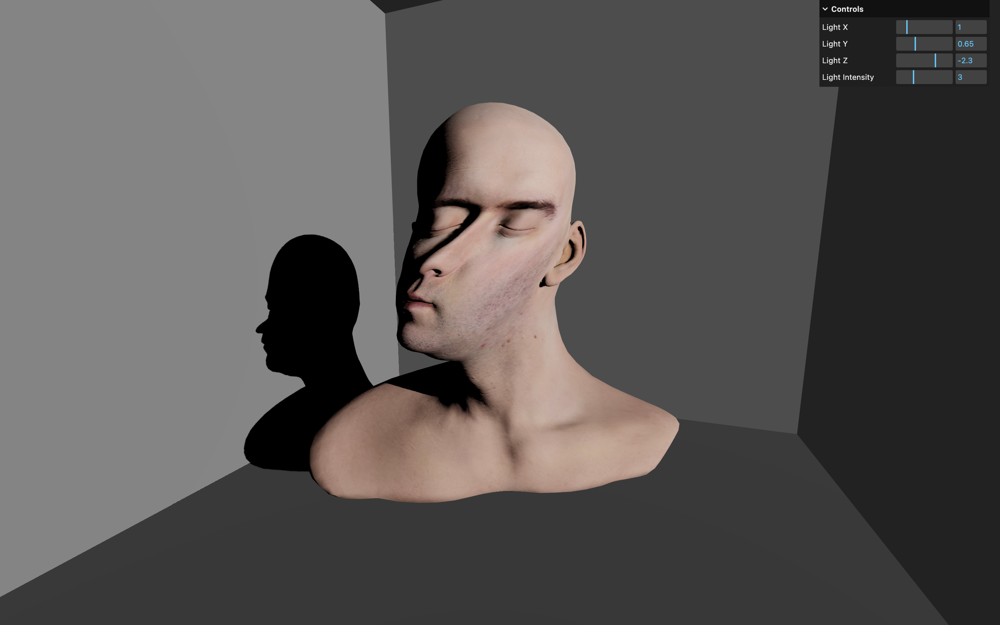

# 🛠️ Three.js – Shader Deformation sur Modèle 3D

Une scène 3D interactive réalisée avec [Three.js](https://threejs.org/) mettant en scène un modèle 3D texturé, animé via des modifications de shaders (vertex shader) et éclairé avec des ombres dynamiques.



## 🚀 Démo

[Voir la démo](https://rekuiem84.github.io/modified-model-materials/)

## ✨ Fonctionnalités

- Chargement d’un modèle GLTF (Lee Perry Smith)
- Textures couleur et normale (color + normal map)
- Déformation du mesh via shader
- Ombres dynamiques
- Matériau de profondeur personnalisé pour des ombres cohérentes avec la déformation

## 🧠 Principe technique

Le matériau `MeshStandardMaterial` est modifié avec `onBeforeCompile` afin d’injecter du code GLSL dans le vertex shader :

- Ajout d’un uniform `uTime`
- Création d’une matrice de rotation 2D
- Rotation des positions et des normales en fonction d'une fonction sin()
- Animation continue basée sur le temps écoulé

Un `MeshDepthMaterial` personnalisé est également modifié pour que les ombres suivent correctement la déformation du mesh.

## 🛠️ Installation & Lancement

1. **Cloner le dépôt :**

   ```bash
   git clone https://github.com/Rekuiem84/modified-model-materials
   cd modified-model-materials
   ```

2. **Installer les dépendances :**

   ```bash
   npm install
   ```

3. **Lancer le serveur :**

   ```bash
   npm run dev
   ```

4. **Build pour la production :**

   ```bash
   npm run build
   ```

   Les fichiers optimisés seront générés dans le dossier `dist/`.

## 📁 Structure du projet

```
├── src/           # Fichiers sources
├── static/        # Fichiers statiques (draco loader, models, textures)
├── dist/          # Fichiers générés pour la production
├── package.json   # Dépendances et scripts
└── vite.config.js # Configuration Vite
```

## 🎛️ Paramètres ajustables via le menu debug

- Position et intensité de la source de lumière

## 🔗 Mes autres projets Three.js

- [Repo Three.js Journey principal](https://github.com/Rekuiem84/threejs-journey) — pour retrouver tous mes projets suivant ce parcours
